<div align="center">


# SyncSpace

**Secure, Real-Time Collaborative Workspace for Modern Teams**

[](LICENSE)
[](https://nodejs.org)
[](https://typescriptlang.org)
[](https://react.dev)
[](https://mongodb.com)
[](https://socket.io)

[](https://syncspace-umber.vercel.app/)
[Live Demo](https://syncspace-umber.vercel.app/) · [View Repository](https://github.com/mishrasourav-prog/syncspace) · [Report a Bug](https://github.com/mishrasourav-prog/syncspace/issues) · [Request a Feature](https://github.com/mishrasourav-prog/syncspace/issues)


</div>

---

## Table of Contents

- [Overview](#overview)
- [The Problem It Solves](#the-problem-it-solves)
- [Key Features](#key-features)
- [Tech Stack](#tech-stack)
- [Project Structure](#project-structure)
- [Getting Started](#getting-started)
  - [Prerequisites](#prerequisites)
  - [Installation](#installation)
  - [Environment Variables](#environment-variables)
  - [Running the App](#running-the-app)
  - [Build and Verification](#build-and-verification)
- [Architecture Deep Dive](#architecture-deep-dive)
  - [Application Hierarchy](#application-hierarchy)
  - [Request Lifecycle](#request-lifecycle)
  - [Authentication and Token Refresh](#authentication-and-token-refresh)
  - [Immediate Session Revocation](#immediate-session-revocation)
  - [Workspace and Project Authorization](#workspace-and-project-authorization)
  - [Event-Driven Backend](#event-driven-backend)
  - [Real-Time Synchronization](#real-time-synchronization)
  - [Frontend State Architecture](#frontend-state-architecture)
  - [Account Deletion and Anonymization](#account-deletion-and-anonymization)
  - [Data Model Overview](#data-model-overview)
- [API Reference](#api-reference)
- [Screenshots](#screenshots)
- [Engineering Decisions](#engineering-decisions)
- [Current Limitations](#current-limitations)
- [Roadmap](#roadmap)
- [Contributing](#contributing)
- [License](#license)

---

## Overview

**SyncSpace** is a production-oriented, full-stack collaboration platform that brings workspaces, projects, tasks, issues, documents, discussions, notifications, activity, and team profiles into one focused system.

Instead of forcing teams to move between disconnected tools, SyncSpace keeps every resource inside the correct organizational context:

```
User
└── Workspace
    └── Project
        ├── Tasks and Issues
        ├── Documents
        ├── Discussions
        ├── Members
        ├── Activity
        └── Notifications
```

A user can create or join workspaces, manage projects, track work through a Kanban board, write structured documents, hold threaded discussions, invite teammates, receive real-time notifications, and manage a secure profile without leaving the platform.

```
Workspace planning + Project execution + Team communication + Real-time synchronization = SyncSpace
```

The project was built with a strong focus on:

- Modular frontend and backend architecture
- Role-based access control
- Secure cookie-based authentication
- Immediate session invalidation
- Typed domain events
- Scoped Socket.IO rooms
- Server-state caching
- Responsive design
- Privacy-safe member profiles
- Maintainable feature boundaries

---

## The Problem It Solves

Teams frequently spread their work across separate products:

| Need | Common Separate Tool |
|---|---|
| Task tracking | Kanban or issue tracker |
| Documentation | Wiki or document editor |
| Discussions | Chat or forum |
| Invitations and roles | Manual admin workflow |
| Activity tracking | Separate audit feed |
| Notifications | Email or third-party alerts |
| Profile and account security | Separate settings system |

This creates several problems:

| Problem | Impact |
|---|---|
| Context is fragmented | Tasks, decisions, documents, and discussions become difficult to connect |
| Access rules drift | Workspace and project permissions become inconsistent |
| Updates become stale | Multiple active users do not see authoritative changes immediately |
| Important work is missed | Notifications are detached from the original resource |
| Account security is weak | Old sessions may remain usable after logout or password changes |
| Team history is fragile | Deleting a user can break references to authored content |

SyncSpace solves this by organizing collaboration around a strict workspace → project hierarchy and connecting every feature through shared authorization, activity, notification, and real-time infrastructure.

---

## Key Features

### 🛡️ Authentication and Account Security

- **JWT Access and Refresh Tokens** — Short-lived access tokens and longer-lived refresh tokens.
- **HTTP-only Cookies** — Browser JavaScript cannot directly access authentication tokens.
- **Automatic Token Refresh** — Axios refresh handling recovers an expired access session without forcing an unnecessary login.
- **Refresh Request Queue** — Multiple simultaneous 401 responses do not create multiple refresh requests.
- **OTP Password Recovery** — Forgot-password, OTP verification, reset-token, and password-reset flows.
- **Enumeration-Safe Responses** — Password-reset endpoints do not reveal whether an account exists.
- **Password Hashing** — Passwords are salted and hashed before storage.
- **Session Versioning** — Tokens are checked against the current database session version.
- **Account-Wide Revocation** — Logout, password changes, password resets, and account deletion revoke old sessions immediately.
- **Multi-Tab Logout** — Connected browser tabs receive a real-time session-revocation event and return to login.
- **Centralized Error Handling** — Validation, database, upload, authentication, and unexpected errors follow one response structure.

### 🏢 Workspace Management

- Create shared workspaces
- View active and archived workspaces
- Update workspace name, description, and metadata
- Archive and restore workspaces
- Workspace overview dashboard, statistics, activity feed, and access summary
- Invite users by email; accept, reject, or cancel invitations
- Role-based workspace membership with owner-aware authorization rules
- Update or remove members; leave a workspace
- Guest membership support

Workspace roles: `owner` · `admin` · `member` · `guest`

### 📁 Project Management

- Create projects inside a workspace
- Project overview dashboard and edit project details
- Archive and restore projects
- Project-level access control
- Invite workspace users into projects; accept, reject, and cancel invitations
- Manage project members and roles; remove members or leave a project
- Project statistics for tasks, issues, documents, and members
- Project activity feed with completion metrics and recent-work summaries

Project roles: `admin` · `member`

### ✅ Tasks and Issues

- Separate task and issue work-item types
- Kanban board view and list view
- Drag-and-drop task reordering
- Search and URL-driven filters (status, type, priority, assignee, due date)
- Task and issue summaries, assignee management, start/due dates
- Parent-task relationships and task comments
- Archive and restore; completed-task profile statistics
- Real-time creation, status, assignment, and reorder updates

Statuses: `TODO` · `IN_PROGRESS` · `IN_REVIEW` · `DONE`
Priorities: `LOW` · `MEDIUM` · `HIGH` · `URGENT`

### 📝 Rich Project Documents

- Project-scoped document library with search, sorting, filtering, list, and grid views
- Active and archived document states
- Rich-text editing powered by TipTap — paragraphs, headings, bold/italic/underline/strike, lists, task lists, blockquotes, links, and tables
- Revision tracking and preview mode
- Duplicate document, export to HTML/JSON, copy document ID
- Archive and restore
- Server-authoritative save behavior with real-time document update notifications

### 💬 Discussions

- Project discussion threads with replies
- Edit and delete operations
- Pin/unpin and lock/unlock discussions
- Participant list and discussion metadata
- Recent discussion activity with role-aware moderation
- Real-time discussion and reply synchronization

### 🔔 Notifications and Activity

- In-app notification center with unread count
- Mark one or all notifications as read
- Workspace and project activity feeds with typed activity metadata
- Domain-event-generated activity records
- Real-time notification invalidation and access-revocation handling
- Resource-aware navigation from notifications

### 👤 Profiles and Account Management

- Editable private profile: name, username, optional headline/bio/location
- Read-only account email
- Avatar upload and removal through Cloudinary (JPEG/PNG/WebP validation, file-size and file-signature verification)
- Workspace, project, and completed-task statistics
- Account information, authentication-provider display, user ID copy action
- Last login and update timestamps
- Password change with deletion-readiness checks (workspace-owner and last-project-admin blockers)
- Secure account deletion with historical-content anonymization
- Privacy-safe, read-only member profiles with workspace/project-context authorization

### 📡 Real-Time Collaboration

- Socket.IO authenticated handshake
- User-scoped, workspace-scoped, and project-scoped rooms
- Task, document, discussion, notification, and activity broadcasts
- Workspace/project access revocation and account session revocation
- Client-side Query cache invalidation with no duplicate Socket.IO client instances

### 🎨 Modern Responsive Frontend

- React 19 and TypeScript with a Tailwind CSS 4 design system
- Persistent authenticated AppShell — desktop sidebar, top navigation, mobile navigation drawer
- Responsive cards and dashboards, loading skeletons, empty states, recoverable error states
- Accessible dialogs and forms, toast notifications, Framer Motion transitions
- Dark workspace-focused interface, touch-friendly mobile actions, responsive down to narrow mobile widths

---

## Tech Stack

### Frontend

| Layer | Technology |
|---|---|
| Framework | React 19, TypeScript, Vite |
| Styling | Tailwind CSS 4 |
| Routing | React Router 7 |
| Server state | TanStack Query 5 |
| Client state | Zustand 5 |
| HTTP | Axios |
| Real-time | Socket.IO Client 4 |
| Forms | React Hook Form, Zod 4 |
| Rich text | TipTap 2 |
| Drag and drop | dnd-kit |
| Motion & UI | Framer Motion, Lucide React, Sonner, next-themes, cmdk, React Flow |

### Backend

| Layer | Technology |
|---|---|
| Runtime | Node.js, Express 5, TypeScript |
| Database | MongoDB, Mongoose 8 |
| Real-time | Socket.IO 4 |
| Auth | JSON Web Tokens, bcrypt/bcryptjs |
| Validation | Zod 4 |
| Uploads | Multer 2, Cloudinary 2 |
| Email | Nodemailer |
| Security & ops | Helmet, CORS, Compression, Morgan, Pino, dotenv |
| Future scaling | Redis Client, Google GenAI SDK (experimental) |

---

## Project Structure

```
syncspace/
├── client/
│   ├── src/
│   │   ├── app/                # App shell, providers, router, store
│   │   ├── components/         # Navigation and shared UI
│   │   ├── features/           # Feature modules (auth, projects, tasks, ...)
│   │   ├── layouts/
│   │   ├── lib/
│   │   ├── realtime/
│   │   └── styles/
│   ├── .env.example
│   ├── package.json
│   ├── tsconfig.json
│   └── vite.config.ts
│
├── server/
│   ├── src/
│   │   ├── config/
│   │   ├── events/
│   │   ├── helpers/
│   │   ├── interfaces/
│   │   ├── middlewares/
│   │   ├── modules/             # Domain modules (auth, workspace, project, tasks, ...)
│   │   ├── routes/
│   │   ├── runtime/
│   │   ├── sockets/
│   │   ├── types/
│   │   ├── utils/
│   │   ├── validators/
│   │   ├── app.ts
│   │   └── server.ts
│   ├── .env.example
│   ├── package.json
│   └── tsconfig.json
│
├── docs/
│   └── screenshots/
├── .gitignore
├── LICENSE
└── README.md
```

**Frontend feature pattern:**

```
feature/
├── api/                 # Axios request functions
├── components/          # Feature UI
├── hooks/               # Query and mutation hooks
├── pages/               # Route-level screens
├── schemas/             # Zod form schemas
├── types/               # TypeScript contracts
└── feature.queryKeys.ts # Stable TanStack Query keys
```

**Backend module pattern:**

```
module/
├── module.model.ts
├── module.validation.ts
├── module.service.ts
├── module.controller.ts
├── module.routes.ts
└── module.subscriber.ts
```

> Not every module needs every file. Event subscribers are used where side effects such as activity, notifications, or real-time broadcasts are required.

---

## Getting Started

### Prerequisites

- **Node.js** — Current LTS release recommended
- **npm**
- **MongoDB** — Local instance or MongoDB Atlas
- **Cloudinary account** — Required for profile avatars
- **SMTP-capable email account** — Required for password-reset OTP delivery
- **Git**

### Installation

Clone the repository:

```bash
git clone https://github.com/mishrasourav-prog/syncspace.git
cd syncspace
```

Install server dependencies:

```bash
cd server
npm install
```

Install client dependencies:

```bash
cd ../client
npm install
```

### Environment Variables

**Server — `server/.env`**

Copy the template:

```bash
cp .env.example .env
```

PowerShell:

```powershell
Copy-Item .env.example .env
```

```env
# Application
NODE_ENV=development
PORT=5000
CLIENT_URL=http://localhost:5173

# MongoDB
MONGODB_URI=mongodb://127.0.0.1:27017/syncspace

# Authentication
ACCESS_TOKEN_SECRET=replace_with_a_long_random_access_token_secret
REFRESH_TOKEN_SECRET=replace_with_a_different_random_refresh_token_secret
RESET_TOKEN_SECRET=replace_with_a_different_random_reset_token_secret

# Password-reset email
EMAIL_USER=your_email@example.com
EMAIL_PASSWORD=your_email_app_password

# Cloudinary avatar storage
CLOUDINARY_CLOUD_NAME=your_cloud_name
CLOUDINARY_API_KEY=your_api_key
CLOUDINARY_API_SECRET=your_api_secret
CLOUDINARY_AVATAR_FOLDER=syncspace/avatars
```

**Client — `client/.env`**

The client environment file is optional during local development when the Vite proxy is used.

```env
VITE_API_BASE_URL=http://localhost:5000/api/v1
VITE_SOCKET_URL=http://localhost:5000
```

> Never commit real `.env` files. Commit only `.env.example` templates.

### Running the App

**Development mode:**

```bash
# Terminal 1 — Start the backend
cd server
npm run dev

# Terminal 2 — Start the frontend
cd client
npm run dev
```

Open:

- App: `http://localhost:5173`
- REST API: `http://localhost:5000/api/v1`

### Build and Verification

**Client:**

```bash
cd client
npm run lint
npm run build
```

**Server:**

```bash
cd server
npm run build
npm start
```

| Command (client) | Description |
|---|---|
| `npm run dev` | Start Vite development server |
| `npm run build` | Type-check and create production build |
| `npm run lint` | Run ESLint |
| `npm run preview` | Preview the production client |

| Command (server) | Description |
|---|---|
| `npm run dev` | Start server with tsx watch |
| `npm run build` | Compile TypeScript to `dist/` |
| `npm start` | Start compiled server |

---

## Architecture Deep Dive

### Application Hierarchy

```
Authenticated User
├── Private Profile
├── Notifications
├── Invitations
└── Workspaces
    ├── Workspace Members
    ├── Workspace Invitations
    ├── Workspace Activity
    └── Projects
        ├── Project Members
        ├── Project Invitations
        ├── Tasks and Issues
        ├── Task Assignees
        ├── Task Comments
        ├── Documents
        ├── Discussions
        ├── Discussion Replies
        └── Project Activity
```

This hierarchy is reflected in routes, service authorization, database references, real-time rooms, frontend query keys, and navigation.

### Request Lifecycle

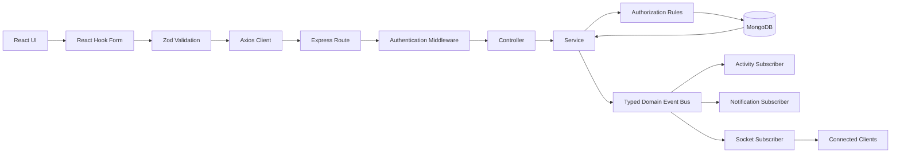

Typical request flow:

```
Browser action
→ Form validation
→ Axios request
→ Express route
→ Authentication middleware
→ Request validation
→ Controller
→ Service
→ Authorization and business rules
→ Mongoose query or transaction
→ MongoDB
→ Domain event publication
→ Activity / notification / Socket.IO subscribers
→ Client cache invalidation
→ Updated interface
```

Controllers remain thin. Services own business logic, authorization, transactions, and event publication.

### Authentication and Token Refresh

```
Registration
  └─► Validate request
      └─► Normalize email and username
          └─► Hash password
              └─► Create User

Login
  └─► Validate credentials
      └─► Compare password
          └─► Generate access token
              └─► Generate refresh token
                  └─► Store refresh token
                      └─► Set HTTP-only cookies

Protected Request
  └─► Read accessToken cookie or Bearer token
      └─► Verify JWT
          └─► Load active User
              └─► Compare sessionVersion
                  └─► Attach trusted req.user
                      └─► Continue request
```

The frontend Axios client:

- sends cookies with requests
- receives a 401 when the access token expires
- performs one refresh request
- queues simultaneous failed requests
- retries them after refresh
- clears the session when refresh is no longer valid

### Immediate Session Revocation

Every access and refresh token carries a `sessionVersion: number`. The User record stores the current database version.

Protected requests require:

```
JWT sessionVersion === database sessionVersion
```

The version changes after: `logout` · `password change` · `password reset` · `account deletion`

The server publishes `USER_SESSION_REVOKED`. The Socket.IO subscriber emits `account:session-revoked`.

Connected clients then:

```
clear Zustand auth state
→ clear TanStack Query cache
→ disconnect Socket.IO
→ navigate to /login
```

This invalidates old sessions immediately instead of waiting for token expiry.

### Workspace and Project Authorization

Authorization is contextual. A user may belong to:

- a workspace but not a project
- a workspace as a guest
- a project as a member
- a project as an administrator
- a workspace as an owner or administrator

Services verify the correct membership before performing operations:

```
Authenticated identity
→ Workspace membership check
→ Workspace role check
→ Project membership check
→ Project role check
→ Resource-level permission
→ Operation allowed or rejected
```

Workspace and project memberships use dedicated collections instead of large embedded arrays.

### Event-Driven Backend

SyncSpace uses a typed in-process domain event bus. Primary business operations are persisted first. Side effects happen through subscribers.

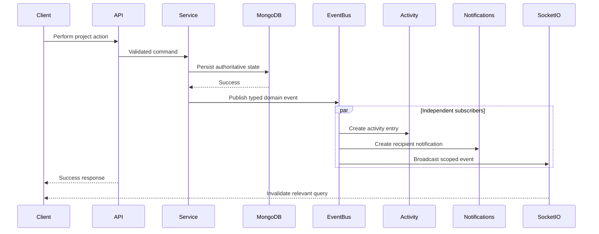

Domain events cover:

- task creation, status changes, assignment, and reordering
- document creation, update, archive, and restore
- discussion creation, update, deletion, pinning, and locking
- discussion reply creation, update, and deletion
- activity creation and notification creation
- project membership ending and workspace membership ending
- user session revocation

Subscriber failures do not falsely report an already-persisted business action as failed.

### Real-Time Synchronization

SyncSpace uses scoped Socket.IO rooms:

| Room | Purpose |
|---|---|
| User room | Notifications and account session revocation |
| Workspace room | Workspace activity and access changes |
| Project room | Tasks, documents, discussions, and project activity |

```
Authenticated socket
→ Join private user room
→ Join authorized workspace room
→ Join authorized project room
→ Receive only relevant events
```

When access ends:

- the user leaves the relevant room
- the client receives an access-revocation event
- protected cached data is cleared or invalidated
- navigation returns to a safe route

REST remains authoritative. Socket.IO communicates that authoritative server state changed; it does not replace persistence.

### Frontend State Architecture

| State Type | Tool | Responsibility |
|---|---|---|
| Authentication identity | Zustand | Compact current-user session |
| Server data | TanStack Query | Fetching, caching, retry, invalidation |
| Forms | React Hook Form | Input state and submission |
| Validation | Zod | Client-side runtime validation |
| Routing and filters | React Router | URLs, params, search state |
| HTTP | Axios | API calls and refresh interceptor |
| Real-time | Socket.IO Client | Scoped live events |
| Rich text | TipTap | Document editing |
| Drag and drop | dnd-kit | Task-board movement |

The compact global `AuthUser` contains only:

```json
{
  "_id": "",
  "name": "",
  "username": "",
  "email": "",
  "avatar": ""
}
```

Extended private profile data remains in TanStack Query rather than expanding every authentication consumer.

### Account Deletion and Anonymization

Account deletion is a controlled workflow.

Before deletion, the server checks whether the user:

- owns one or more workspaces
- is the last administrator of one or more projects

If blockers exist, the Profile UI explains what must be resolved.

When deletion is allowed:

- current workspace and project memberships are removed
- task assignments are removed
- received notifications are removed
- OTP and invitation records are cleaned up
- avatar cleanup is attempted
- credentials are removed
- all sessions are revoked
- the User identity is anonymized

Historical authored content remains connected to a tombstone `Deleted user`, preserving project history without preserving personal access or identity.

### Data Model Overview

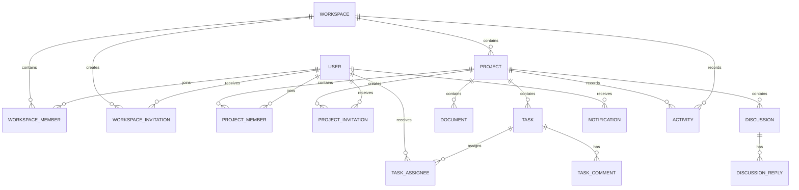

Core collections: Users · Workspaces · Workspace Members · Workspace Invitations · Projects · Project Members · Project Invitations · Tasks and Issues · Task Assignees · Task Comments · Documents · Discussions · Discussion Replies · Notifications · Activities · OTP Records

**Indexing strategy** supports common access patterns such as: unique email/username, unique workspace/project membership, workspace and project member lookup, project role lookup, task status/ordering/type, archived state, due dates, parent tasks, completed-task profile statistics, invitation lookup, and notification recipient lookup.

---

## API Reference

All REST routes are prefixed with `/api/v1`. The following tables list representative routes.

### Authentication Routes `/api/v1/auth`

| Method | Path | Description | Auth |
|---|---|---|---|
| `POST` | `/register` | Register a new user | — |
| `POST` | `/login` | Login with email and password | — |
| `POST` | `/refresh` | Refresh access token | Refresh cookie |
| `POST` | `/logout` | Revoke the current account session | ✅ |
| `GET` | `/me` | Get current compact authenticated user | ✅ |
| `POST` | `/forgot-password` | Send password-reset OTP | — |
| `POST` | `/verify-reset-otp` | Verify password-reset OTP | — |
| `POST` | `/reset-password` | Reset password and revoke sessions | — |
| `POST` | `/resend-reset-otp` | Resend password-reset OTP | — |

### Workspace Routes

| Method | Path | Description | Auth |
|---|---|---|---|
| `GET` | `/workspaces` | List accessible workspaces | ✅ |
| `POST` | `/workspaces` | Create workspace | ✅ |
| `GET` | `/workspaces/:workspaceId` | Get workspace details | ✅ |
| `PATCH` | `/workspaces/:workspaceId` | Update workspace | ✅ |
| `POST` | `/workspaces/:workspaceId/archive` | Archive workspace | ✅ |
| `POST` | `/workspaces/:workspaceId/restore` | Restore workspace | ✅ |
| `GET` | `/workspaces/:workspaceId/members` | List members | ✅ |
| `PATCH` | `/workspaces/:workspaceId/members/:memberId` | Update member role | ✅ |
| `DELETE` | `/workspaces/:workspaceId/members/:memberId` | Remove member | ✅ |
| `POST` | `/workspaces/:workspaceId/leave` | Leave workspace | ✅ |

### Workspace Invitation Routes

| Method | Path | Description | Auth |
|---|---|---|---|
| `POST` | `/workspaces/:workspaceId/invitations` | Create invitation | ✅ |
| `GET` | `/workspace-invitations` | List current-user invitations | ✅ |
| `POST` | `/workspace-invitations/:invitationId/accept` | Accept invitation | ✅ |
| `POST` | `/workspace-invitations/:invitationId/reject` | Reject invitation | ✅ |
| `DELETE` | `/workspace-invitations/:invitationId` | Cancel invitation | ✅ |

### Project Routes

| Method | Path | Description | Auth |
|---|---|---|---|
| `GET` | `/workspaces/:workspaceId/projects` | List workspace projects | ✅ |
| `POST` | `/workspaces/:workspaceId/projects` | Create project | ✅ |
| `GET` | `/projects/:projectId` | Get project details | ✅ |
| `PATCH` | `/projects/:projectId` | Update project | ✅ |
| `POST` | `/projects/:projectId/archive` | Archive project | ✅ |
| `POST` | `/projects/:projectId/restore` | Restore project | ✅ |
| `GET` | `/projects/:projectId/members` | List project members | ✅ |
| `PATCH` | `/projects/:projectId/members/:memberId` | Update project role | ✅ |
| `DELETE` | `/projects/:projectId/members/:memberId` | Remove project member | ✅ |
| `POST` | `/projects/:projectId/leave` | Leave project | ✅ |

### Task and Issue Routes

| Method | Path | Description | Auth |
|---|---|---|---|
| `GET` | `/projects/:projectId/tasks` | List tasks and issues | ✅ |
| `POST` | `/projects/:projectId/tasks` | Create task or issue | ✅ |
| `GET` | `/tasks/:taskId` | Get task details | ✅ |
| `PATCH` | `/tasks/:taskId` | Update task | ✅ |
| `DELETE` | `/tasks/:taskId` | Archive/delete task according to service rules | ✅ |
| `POST` | `/projects/:projectId/tasks/reorder` | Reorder task board | ✅ |

### Document Routes

| Method | Path | Description | Auth |
|---|---|---|---|
| `GET` | `/projects/:projectId/documents` | List project documents | ✅ |
| `POST` | `/projects/:projectId/documents` | Create document | ✅ |
| `GET` | `/documents/:documentId` | Get document | ✅ |
| `PATCH` | `/documents/:documentId` | Update document | ✅ |
| `POST` | `/documents/:documentId/archive` | Archive document | ✅ |
| `POST` | `/documents/:documentId/restore` | Restore document | ✅ |

### Discussion Routes

| Method | Path | Description | Auth |
|---|---|---|---|
| `GET` | `/projects/:projectId/discussions` | List discussions | ✅ |
| `POST` | `/projects/:projectId/discussions` | Create discussion | ✅ |
| `GET` | `/discussions/:discussionId` | Get discussion | ✅ |
| `PATCH` | `/discussions/:discussionId` | Update discussion | ✅ |
| `POST` | `/discussions/:discussionId/replies` | Create reply | ✅ |
| `PATCH` | `/discussion-replies/:replyId` | Update reply | ✅ |
| `DELETE` | `/discussion-replies/:replyId` | Delete reply | ✅ |

### Activity and Notification Routes

| Method | Path | Description | Auth |
|---|---|---|---|
| `GET` | `/workspaces/:workspaceId/activities` | Workspace activity | ✅ |
| `GET` | `/projects/:projectId/activities` | Project activity | ✅ |
| `GET` | `/notifications` | List notifications | ✅ |
| `GET` | `/notifications/unread-count` | Get unread count | ✅ |
| `PATCH` | `/notifications/:notificationId/read` | Mark one as read | ✅ |
| `PATCH` | `/notifications/read-all` | Mark all as read | ✅ |

### Profile Routes `/api/v1/users`

| Method | Path | Description | Auth |
|---|---|---|---|
| `GET` | `/me/profile` | Get complete private profile | ✅ |
| `PATCH` | `/me/profile` | Update supported profile fields | ✅ |
| `POST` | `/me/avatar` | Upload or replace avatar | ✅ |
| `DELETE` | `/me/avatar` | Remove avatar | ✅ |
| `PATCH` | `/me/password` | Change password and revoke sessions | ✅ |
| `GET` | `/me/deletion-readiness` | Check account-deletion blockers | ✅ |
| `DELETE` | `/me` | Delete and anonymize account | ✅ |
| `GET` | `/:userId/profile?workspaceId=...&projectId=...` | Get context-authorized member profile | ✅ |

---

## Screenshots

The screenshots below show the current SyncSpace interface across authentication, workspace management, project collaboration, rich-text documents, discussions, profiles, and mobile layouts.

### 🚀 Landing Page

<p align="center">
  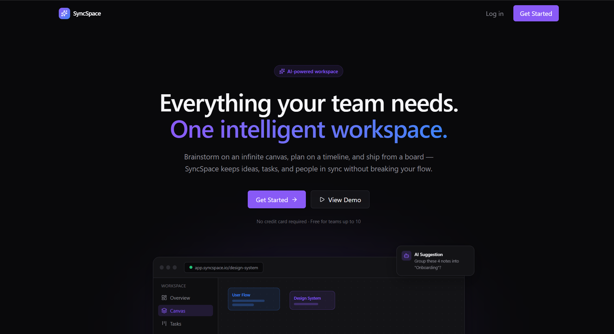
</p>
<p align="center"><em>Product landing experience and primary call-to-action</em></p>

### 🔐 Authentication

<p align="center">
  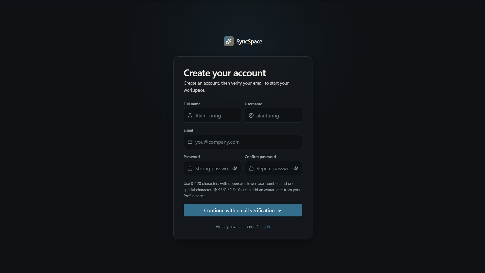
</p>
<p align="center"><em>Account registration interface</em></p>

### 📊 Workspace Dashboard

<p align="center">
  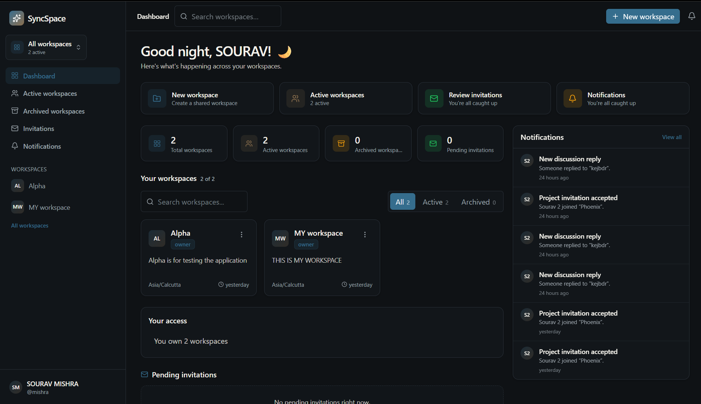
</p>
<p align="center"><em>Workspace dashboard with statistics, invitations, notifications, and quick actions</em></p>

### 🏢 Workspace Overview

<p align="center">
  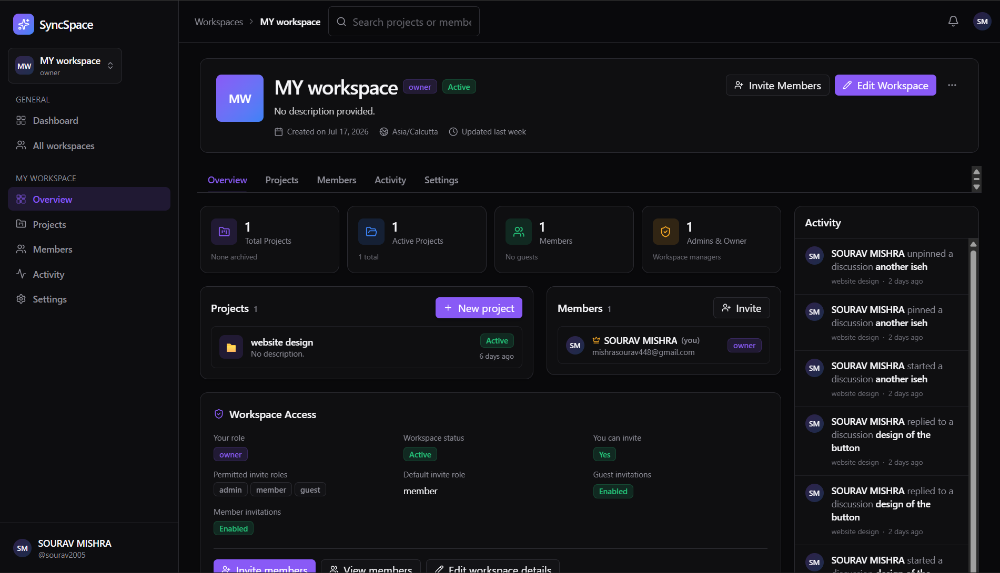
</p>
<p align="center"><em>Workspace statistics, projects, members, access information, and activity</em></p>

### 📁 Project Overview

<p align="center">
  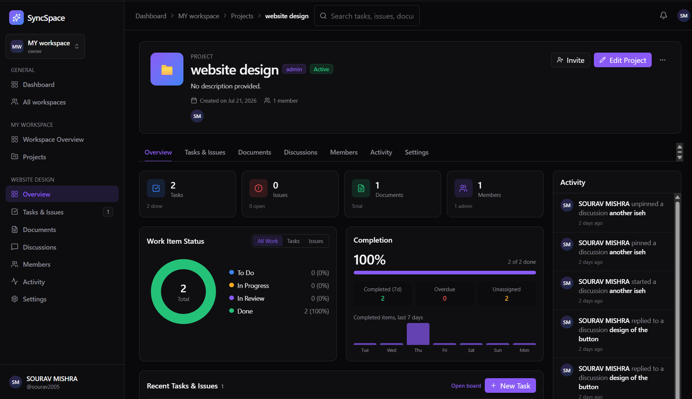
</p>
<p align="center"><em>Project metrics, task completion, member access, recent work, and activity</em></p>

### ✅ Tasks and Issues

<p align="center">
  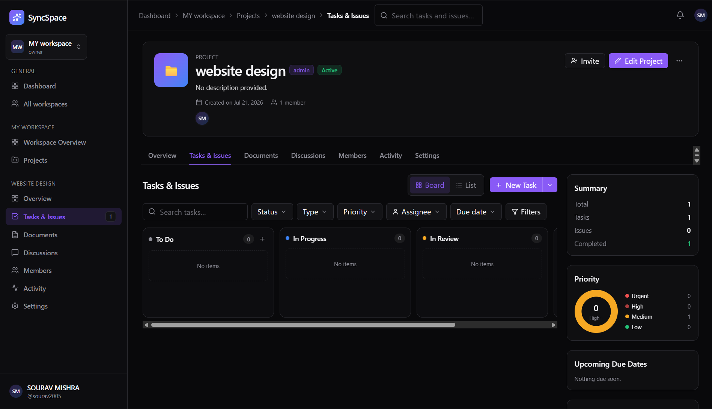
</p>
<p align="center"><em>Kanban board, filters, summaries, priorities, and status-based workflow</em></p>

### 📝 Document Library

<p align="center">
  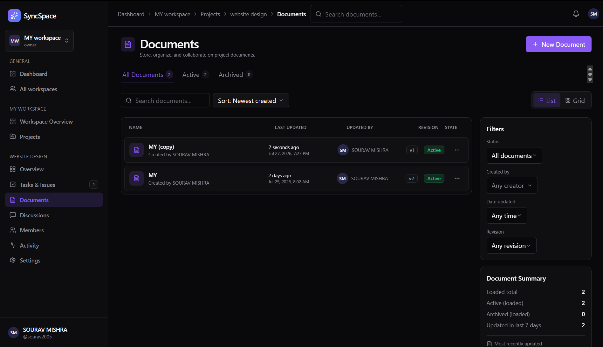
</p>
<p align="center"><em>Project document search, filtering, revisions, and archive state</em></p>

### ✍️ Rich-Text Document Editor

<p align="center">
  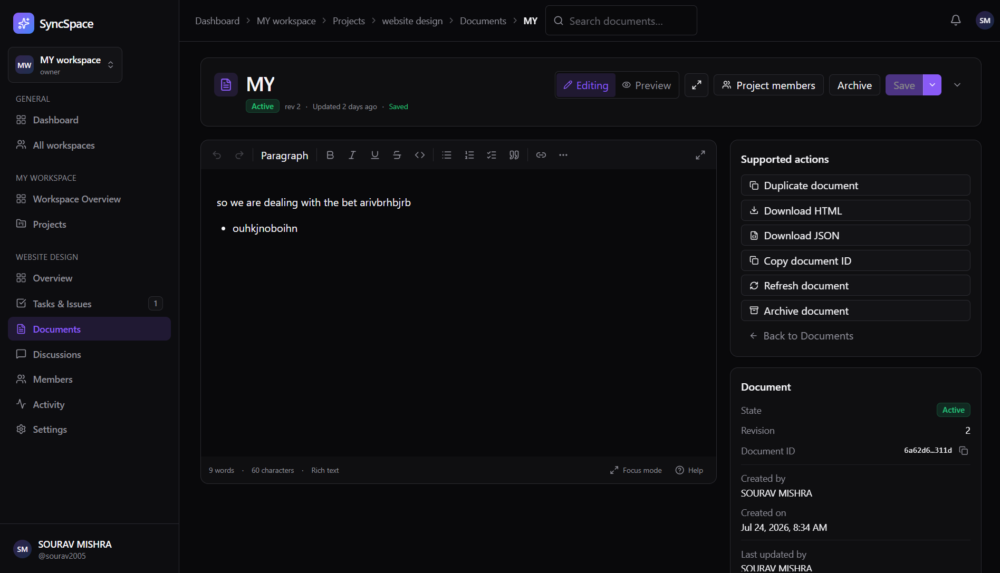
</p>
<p align="center"><em>TipTap-powered rich-text editing, preview, export, duplication, and document metadata</em></p>

### 💬 Project Discussions

<p align="center">
  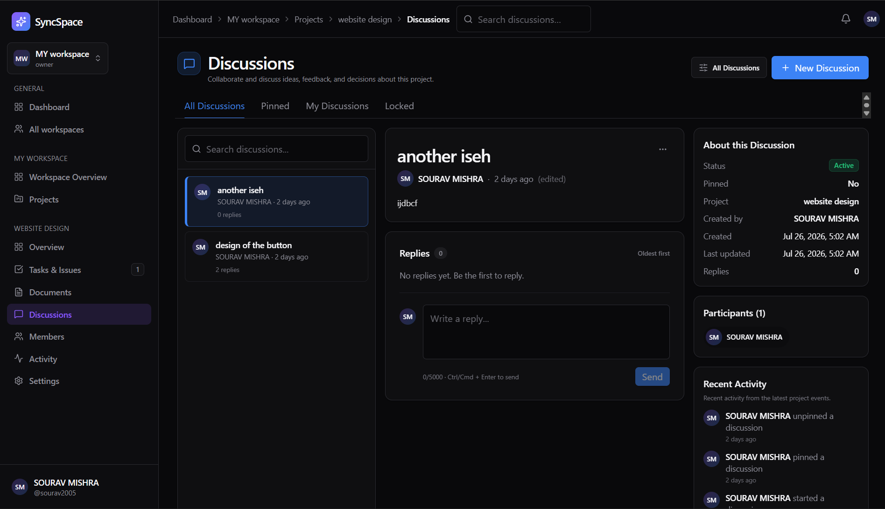
</p>
<p align="center"><em>Threaded discussions, replies, participants, moderation, metadata, and activity</em></p>

### 👤 Profile and Account Management

<p align="center">
  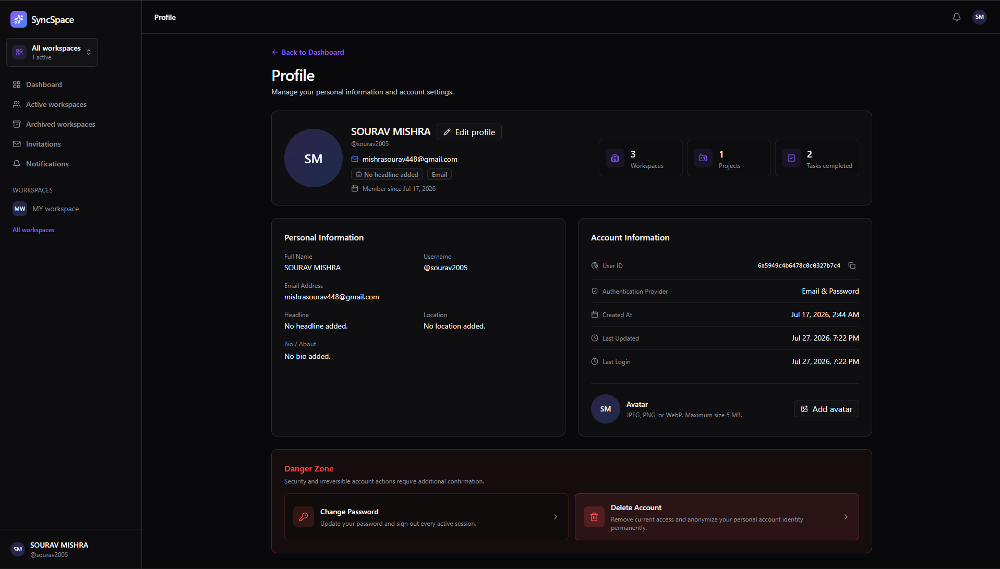
</p>
<p align="center"><em>Private profile, account metadata, statistics, avatar management, password security, and account deletion</em></p>

### 📱 Responsive Mobile Experience

<table>
  <tr>
    <td align="center">
      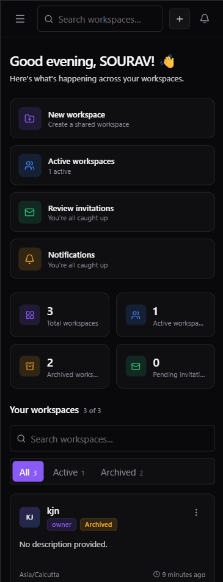
    </td>
    <td align="center">
      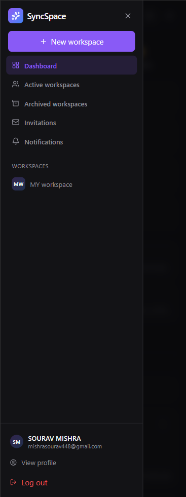
    </td>
  </tr>
  <tr>
    <td align="center"><em>Responsive dashboard</em></td>
    <td align="center"><em>Authenticated navigation drawer</em></td>
  </tr>
</table>

---

## Engineering Decisions

**Referenced Membership Collections** — Workspace and project memberships use separate collections instead of embedded arrays, giving unique membership constraints, efficient role lookup, independent membership lifecycle, simpler leave/remove operations, support for larger teams, and clearer authorization queries.

**Feature-Based Frontend** — The frontend is organized by business feature. Each feature owns its request functions, schemas, types, query keys, hooks, components, and route-level pages — reducing cross-feature coupling.

**Thin Controllers and Service-Owned Rules** — Controllers parse and validate request data, call services, and return a consistent response. Services enforce authorization, perform database queries and transactions, protect business invariants, and publish domain events.

**REST Plus Socket.IO** — REST remains authoritative for reads and mutations. Socket.IO communicates that data changed so connected clients can invalidate or update the correct cache, avoiding real-time messages as an alternative database.

**Context-Authorized Member Profiles** — Member profiles are not globally public. The request must contain a shared workspace or project context; unauthorized and nonexistent combinations return the same privacy-safe response.

**Anonymization Instead of Destructive History Removal** — Deleting a user should not destroy collaborative history. SyncSpace removes access and personal identity while preserving authored-resource references through an anonymized tombstone User.

**URL-Driven Task Filters** — Task view and filters use URL search parameters so filters survive refresh, views can be shared, browser navigation remains predictable, and task state is not hidden in local component state.

**Graceful Shutdown** — The server handles termination signals by closing Socket.IO, the HTTP server, and the MongoDB connection, with a timeout fallback to prevent stalled shutdowns.

**Query Cache as the Server-State Source** — TanStack Query owns server data. Zustand stores only compact authentication identity, avoiding duplication of large workspace, project, task, document, or profile objects in global state.

---

## Current Limitations

- Automated unit, integration, and browser end-to-end tests are not yet included
- A public production deployment URL is not yet documented
- Distributed Socket.IO scaling is not yet enabled
- Redis is not yet configured as a Socket.IO adapter
- External email delivery is not yet processed through a background-job queue
- CI/CD workflows are not yet included
- Production monitoring and tracing are not yet configured
- Workspace ownership transfer is not yet available
- Workspace export is not yet available
- AI-assisted workspace features are not yet part of the documented stable workflow
- Additional screenshots such as read-only Member Profile, Notifications, Task Detail, and invitation dialogs can be added later

---

## Roadmap

- [ ] Add a public production deployment
- [ ] Add unit tests for services, schemas, and permissions
- [ ] Add API integration tests
- [ ] Add browser end-to-end tests
- [ ] Add GitHub Actions for lint, build, and tests
- [ ] Add Redis-backed Socket.IO scaling
- [ ] Add background jobs for email and external services
- [ ] Add workspace ownership transfer
- [ ] Add workspace export
- [ ] Add structured monitoring and observability
- [ ] Add deployment documentation
- [ ] Add OpenAPI documentation
- [ ] Add read-only Member Profile screenshots
- [ ] Add task detail and notification screenshots
- [ ] Evaluate AI-assisted workspace summaries and suggestions

---

## Contributing

Contributions, bug reports, and improvement suggestions are welcome.

1. **Fork** the repository
2. **Create** a focused feature branch:
   ```bash
   git checkout -b feat/your-feature-name
   ```
3. Make the required changes
4. **Verify** the client:
   ```bash
   cd client
   npm run lint
   npm run build
   ```
5. **Verify** the server:
   ```bash
   cd server
   npm run build
   ```
6. **Commit** with a clear conventional message:
   ```bash
   git commit -m "feat: describe the change"
   ```
7. **Push** the branch:
   ```bash
   git push origin feat/your-feature-name
   ```
8. **Open a Pull Request** against `main`

Please follow these guidelines:

- Keep pull requests focused
- Explain what changed and why
- Do not commit `.env` files
- Do not commit `node_modules` or `dist`
- Do not commit credentials, logs, runtime uploads, or backup ZIPs
- Run lint and builds before opening a pull request

### Bug Reports

Use the [GitHub Issues](https://github.com/mishrasourav-prog/syncspace/issues) page. Include:

- Operating system
- Node.js version
- Browser
- Steps to reproduce
- Expected behavior
- Actual behavior
- Screenshots or logs when useful

---

## License

Distributed under the MIT License. See [`LICENSE`](LICENSE) for full terms.

---

<div align="center">

**Built by [Sourav Mishra](https://github.com/mishrasourav-prog)**

*SyncSpace — keeping teams, projects, and knowledge in sync.*

</div>